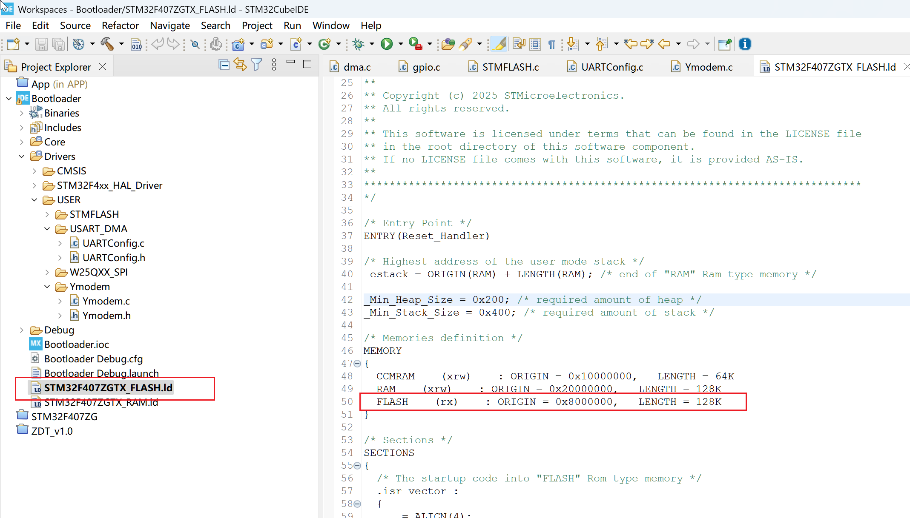
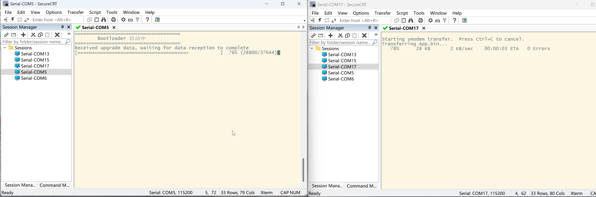
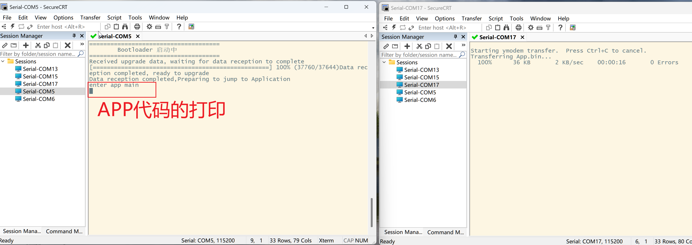

# 此文档记录学习及编写IAP代码的过程
```bash
Ymodem协议的结构体
typedef struct
{
    uint8_t currentBlockNum;    //当前块号
    uint16_t currentBlockSize;	//当前包大小
    uint16_t totalBlockSize;	//当前包总大小
    uint8_t fileBuffer[1024+5];	//单包缓冲	128+5/1024+5
    uint8_t fileName[128];      //文件名--------------只有头包数据有
    uint8_t fileSizeHex[128];	//文件大小--接收的数据
    uint32_t fileSize;          //文件大小
    YMODEM_State state;       	//当前接收状态

    uint8_t rec_EOTcount;		//接收EOT的次数
    volatile uint8_t uartRecFlag;//串口接收完成标志位  0：空闲	1：接收完成
    uint32_t writeIndex;		//已经写入的字节大小
    uint8_t writeData[FlashWrite_Once];//将要写入的实际数据-页/块写入
    uint8_t retryCount;			//记录数据传输过程中错误次数，要求重发并记录重发次数
    uint32_t timeOut;			//记录空闲状态下，发送请求的时间

//    void (*ymodem_memoryWrite)(uint32_t addr,uint32_t len,uint8_t *writeBuffer);//绑定写入FLASH的函数
}YMODEM_Data;
```
## 1.bootloader使用资源
### a.串口+DMA
    接收数据采用串口+DMA:
        USART1+DMA空闲中断:用于接收外部传来的ymodem数据
        USART2:用于打印信息(也可以使用USART1,但是secureCRT在开始传输时，打印数据不会显示)
```bash
/**********************************************************************/
//串口1的DMA空闲中断接收(禁用半中断)----USART_DMA/UARTConfig.c文件中
void uartYmodemInit(void)
{
    HAL_UARTEx_ReceiveToIdle_DMA(ymodem_UARTHANDLE, ymodem_Info.fileBuffer, sizeof(ymodem_Info.fileBuffer));
    __HAL_DMA_DISABLE_IT(ymodem_hdmarx, DMA_IT_HT);
}
void HAL_UARTEx_RxEventCallback(UART_HandleTypeDef *huart, uint16_t Size)
{
    if(huart->Instance == USART1)  		//串口IAP
    {
    	ymodem_Info.currentBlockSize =Size;
    	ymodem_Info.uartRecFlag = 1;
        HAL_UARTEx_ReceiveToIdle_DMA(ymodem_UARTHANDLE, ymodem_Info.fileBuffer, sizeof(ymodem_Info.fileBuffer));
        __HAL_DMA_DISABLE_IT(ymodem_hdmarx, DMA_IT_HT);
    }
}

//串口2的printf打印----usart.c文件中
#include "stdio.h"
#ifdef __GNUC__
  #define PUTCHAR_PROTOTYPE int __io_putchar(int ch)
#else
  #define PUTCHAR_PROTOTYPE int fputc(int ch, FILE *f)
#endif
PUTCHAR_PROTOTYPE
{
  HAL_UART_Transmit(&huart2,(uint8_t *)&ch,1,0xFFFF);
  return ch;
}
/**********************************************************************/
```
### b.STM-FLASH操作
    这里不放代码，可以在工程中查看 STMFLASH/STMFLASH.c文件
    需要注意的是，擦除的判断条件是待写入位置是否不为0xFF，FLASH的写入可以修改0xFF为其他数值，即将1-->0,但是不能反过来，因此需要考虑是否擦除后写，这里直接擦除待写区域全部内容(擦除对应的扇区)，然后写入
## 2.编写ymodem实现流程
### a.编写初始帧解析函数
```bash
    bool ymodem_InitialFrameAnalysis(const uint8_t *pdata,uint16_t len)
//secureCRT的初始帧的文件名以00结尾，但是文件大小却以' '(空格)结尾 
    // 2. 提取文件大小
    uint8_t j=0;
    while ((i < 128) && (dataPtr[i] != ' '|| dataPtr[i] != '\0'))
    {
    	ymodem_Info.fileSizeHex[j++] = dataPtr[i++];
    }
    ymodem_Info.fileSizeHex[j] = '\0'; // 字符串结束符
```
    判断初始帧的数据，并将数据解析存储到ymodem_Info.fileName,ymodem_Info.fileSize中，其中ymodem_Info.fileSize是检验传输文档大小的可靠数据，也用来和写入的FLASH的大小进行比较
### b.编写数据帧解析函数
```bash
    bool ymodem_DataFrameAnalysis(const uint8_t *pdata,uint16_t len)
    {
	    uint16_t DataNum=(pdata[0]==ymodem_SOH)?128:1024;
	    return HandleSOH_STX(pdata,len,DataNum);
    }
    bool HandleSOH_STX(const uint8_t *pdata,uint16_t len,uint16_t DataNum)
```
    HandleSOH_STX是实际的解析数据,但是由于ymodem传输存在128/1024两种形式，因此选择uint16_t DataNum作为传入参数进行判断，HandleSOH_STX函数中判断帧头信息后，便会判断如何写入FLASH，写入函数如下：
    STMFLASH_Write_NoErase(APP_ADDR+ymodem_Info.writeIndex- FlashWrite_Once, ymodem_Info.writeData,FlashWrite_Once);
### c.编写结束帧解析函数
```bash
    bool ymodem_EndFrameAnalysis(const uint8_t *pdata,uint16_t len)
```
    判断结束帧的信息，这里需要注意，secureCRT传输的结束帧不为00，
    正常数据：SOH 00 FF 00 00 00 00 00 00 00---00 CRCH CRCL
    实际数据：SOH 00 FF 00 30 20 30 20 30 00---00 A2    7C
### d.整体接收处理流程
    首先，接收处理流程一共四步:     ymodem_Info.state
        1️⃣ 空闲阶段 (等待起始帧，解析文件信息)
        2️⃣ 接收数据阶段 (接收并存储数据块)
        3️⃣ 结束阶段 (接收结束帧 EOT，收尾处理)
        4️⃣ 错误阶段 (处理错误并终止传输)
    第一步：周期性发送C(0X43)，等待DMA接收数据完成的标志位后,调用ymodem_InitialFrameAnalysis()解析初始帧信息并回应等待数据帧的到来
    第二步：等待DMA空闲中断触发返回接收完成标志位ymodem_Info.uartRecFlag为1，可以开始处理数据，数据有误发送NAK请求重发，直到数据接收完毕(错误次数允许范围内)。此处IAP操作是直接是直接写到APP区，直接替换原来的数据进行升级，如果觉得不安全，可以把数据放在外置的FLASH上，通过更新标志位(存在FLASH的更新标志位)来判断是否升级
    第三步：接收结束帧EOT，根据协议进行回应，并解析最后一帧结束帧数据
    注：若以上接收数据帧过程出现问题次数超过MAX_RETRY，就会发送终止传输命令(当前IAP直接写到FLASH存放APP的弊端，接收出错，APP跳转后出问题)
```bash
    修改方式如下：
    void ymodem_InfoAnalysis(void)
        ----STMFLASH_EraseArea(APP_ADDR, ymodem_Info.fileSize);//擦除FLASH操作

    bool HandleSOH_STX(const uint8_t *pdata,uint16_t len,uint16_t DataNum)
        ----STMFLASH_Write_NoErase();//写扇区操作
    将以上位置的擦写函数替换成外部FLASH的擦写函数(从片上FLASH的擦写替换成W25QXX的擦写)
```
## 3.编写跳转程序
### a.跳转函数的编写及注意事项
    这里有几点需要注意：
    1.Cubeide编译生成的bin的第一个字是0x20020000，而不是0x20000000，具体使用时可以先查看一次
    2.使用哪个中断，可以先关闭外设功能，再关闭中断
    3.设置栈顶指针和中断向量表的偏移地址
```bash
typedef  void (*pFunction)(void);
pFunction Jump_To_Application;

void update_JumpToApplication(void)//跳转到APP地址
{
	uint32_t JumpAddress;
    //if (((*(__IO uint32_t*)APP_ADDR) & 0x2FFE0000 ) == 0x20000000)//网上使用的是0x20000000，使用cubeide观察是0x20020000
    if (((*(__IO uint32_t*)APP_ADDR) & 0x2FFE0000 ) == 0x20020000)//建议下载后连接stlink-unity或者读一下该地址内容
    {
/****************************************使能了哪些中断就关掉那些*********************************************/
    	//对于有中断的外设，尽量先停掉，然后再关中断，不然跳转到app会卡死，当前工程使用的是串口中断+DMA接收中断
    	HAL_UART_DMAStop(&huart1);          //停止DMA传输
    	HAL_DMA_Abort(&hdma_usart1_rx);		//停掉dma的传输
    	HAL_NVIC_DisableIRQ(USART1_IRQn);
    	HAL_NVIC_DisableIRQ(DMA2_Stream2_IRQn);//失能使用的中断
/****************************************使能了哪些中断就关掉那些*********************************************/

//        HAL_RCC_DeInit();//有的论坛中说明需要此行，但是实际测试不影响

//跳转
		SCB->VTOR = APP_ADDR;  //重定位向量表
		__set_MSP(*(__IO uint32_t*) APP_ADDR);//设置栈顶指针
		JumpAddress = *(__IO uint32_t*) (APP_ADDR + 4);
		Jump_To_Application = (pFunction) JumpAddress;
		Jump_To_Application();
    }
}
```
### b.设置下载FLASH的大小(Cubeide工程)
    设置的bootloader的大小为128KB，因此在STM32F407ZGTX_FLASH.ld文件中需要修改为128KB
    #define APP_ADDR	0X08020000	//写APP的FLASH位置,bootloader预留128kB



## 功能实现

