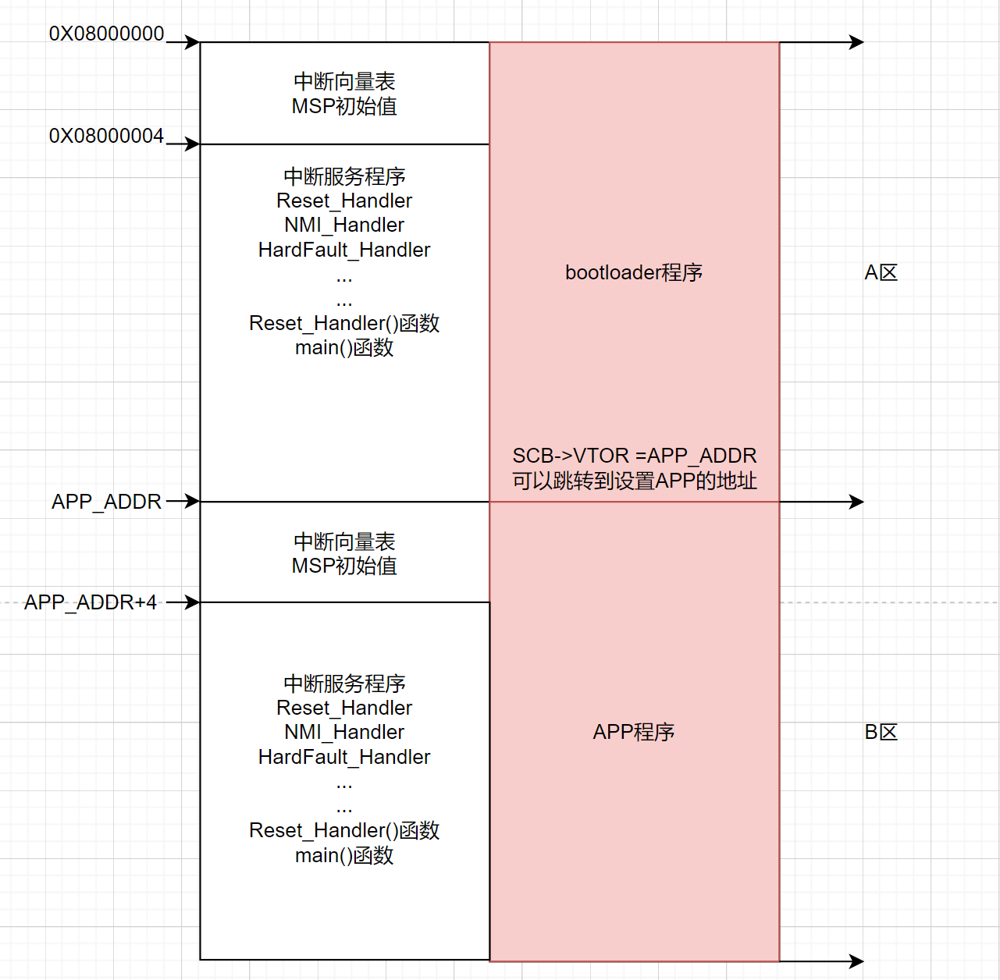
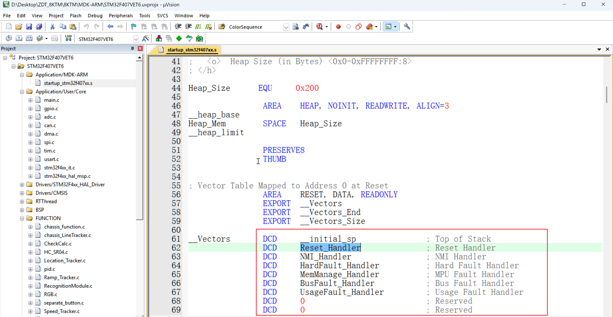

# 此文档记录学习及编写OTA代码的过程
## 工程使用CubeMX配置STM32F407ZGT6相关外设实现功能：
### 1.OTA操作原理
    OTA整体流程:http://www.51hei.com/stm32/4315.html
    注意事项:https://www.stmcu.org.cn/module/forum/forum.php?mod=viewthread&tid=627799&highlight=iap
        本质上是在内置的FLASH上进行分区，这里以bootloader为A区，APP为B区将FLASH分为两部分进行分析：
        注意：A区和B区都是完整的工程代码，都是可以运行的，实际使用时先进入A区，然后在A区代码中跳到B区
        1.每次上电会默认进入A区，进入后判断是否有更新标志位，有就将代码复制到B区，没有就直接跳转到B区
        2.代码数据处理完毕，关闭中断，重新设置栈顶指针(指向B区地址),并将指针指向偏移4字节(B区开头+4)的位置


### 2.OTA-bootloader工程编写过程
#### a.工程所需操作
    需要使用的外设有:   
        FLASH:存放升级
            片内FLASH:存放升级后的代码(替换原APP程序，写入地址为APP_ADDR)
            片外FLASH:
                W25QXX(SPI):存放通过由串口或远程等方式传来的代码文件，并给出代码更新标志位
        USART:打印信息/串口IAP升级
        
        这里对数据的传输使用Ymodem协议:https://www.cnblogs.com/zzssdd2/p/15418778.html
[点击查看ymodem相关文档](./Ymodem.md)--包含一些secureCRT使用中的不同点
#### b.IAP工程编写过程
[点击查看IAP工程](./IAP/)

    注:IAP工程直接接收串口传来的数据，并直接写到APP对应的FLASH地址中，然后跳转到APP,工程文档在IAP文件夹中
    bootloader工程:
        1.编写ymodem相关代码(这里只编写接收函数)
        2.编写FLASH操作(片上FLASH)
        3.设置跳转指针，设置栈顶指针
    app工程：
        1.执行闪灯程序
### 3.OTA工程编写过程
    


### 4.OTA-整体测试  

## 使用方法

```bash
    测试md文件的语法
```
<!--     -->