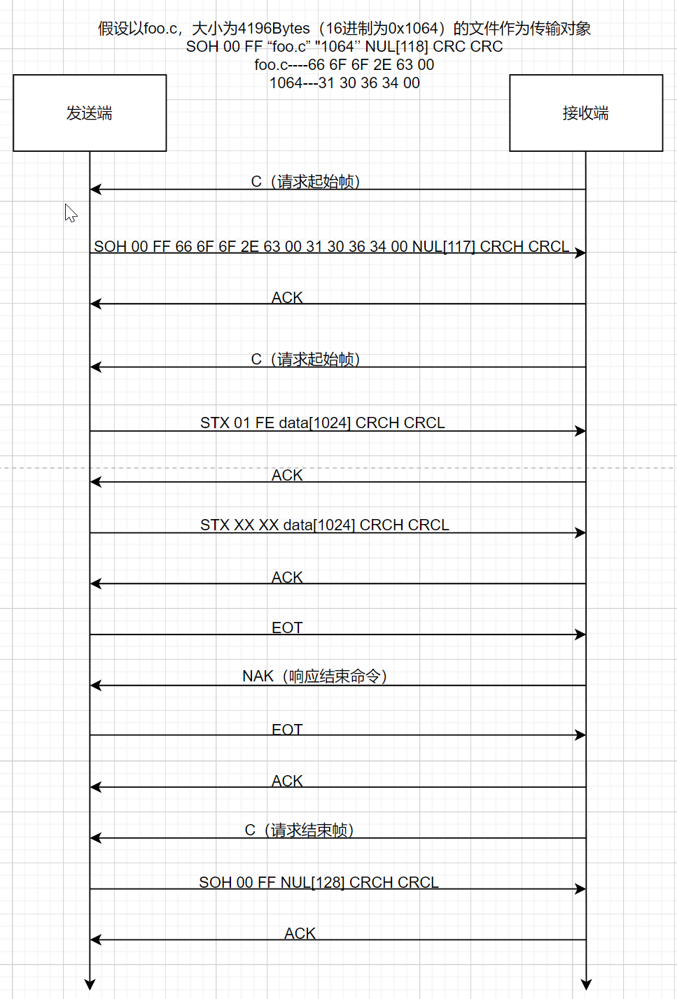

# 此文档记录Ymode相关内容
## 协议符号说明
    符号    数值    含义
    SOH     0X01    128字节数据包
    STX     0X02    1024字节数据包
    EOT     0X04    结束传输
    ACK     0X06    正确接收回应
    NAK     0X15    错误接受回应
    CAN     0X18    传输中止
    C       0X43    请求数据
## 起始帧
```bash
    帧头    帧序    帧序反码    文件名      文件大小    NULL        CRCH      CRCL
    SOH     00      FF         n Bytes    m Bytes    x Bytes     1 Byte    1 Byte
```
    含义如下:
        SOH：表示这个数据帧中包含着128个字节的数据段
        00：表示数据帧序号，初始是0，依次递增(满255从0开始)
        FF：是帧序号的取反(提供一种数据是否正确的判断依据)
        数据段(128byte)：文件名(n Bytes) + 文件大小(m Bytes) + NULL(x Bytes) 
        CRC-H和CRC-L分别表示16位CRC校验码的高8位与低8位，校验只针对数据段
### 注意事项
        文件名：例如文件名是foo.c，ACSII字符转换为HEX字符就是66 6F 6F 2E 63。它在数据帧中存放格式为66 6F 6F 2E 63 00 ，最后加一个00表示文件名字段结束
        文件大小：假如上面的foo.c文件大小为1024字节，转化成16进制即0x400。它在数据帧中存放格式为34 30 30 00，即ASCII格式的400，最后加一个00表示文件大小字段结束
        NULL：数据部分大小为128字节，除去文件名与文件大小占用的空间外，剩余的x Bytes全部用00填充
## 数据帧
```bash
    帧头    帧序    帧序反码    数据        CRCH      CRCL
    SOH     ID      ~ID        128 Bytes  1 Byte    1 Byte
    STX     ID      ~ID       1024 Bytes  1 Byte    1 Byte
```
    含义如下:
        SOH：表示这个数据帧中包含着128个字节的数据段    STX:表示这个数据帧中包含着1024个字节的数据段
        ID ：0x00-0xFF
        FF：是帧序号的取反(提供一种数据是否正确的判断依据)
        数据段：128/1024 Bytes
        CRC-H和CRC-L分别表示16位CRC校验码的高8位与低8位，校验只针对数据段
### 注意事项
    最后一帧数据在128-1024之间：除数据外剩余(1024-n)空间全部用0x1A填充
        帧头    帧序    帧序反码    数据        CRCH      CRCL
        STX     ID      ~ID       N+(1024-n)    1        1
    最后一帧数据在0-128之间(会强制选择SOH帧头传输数据)：除数据外剩余(128-n)空间全部用0x1A填充
        帧头    帧序    帧序反码    数据        CRCH      CRCL
        SOH     ID      ~ID       N+(128-n)    1        1
## 结束帧
```bash
    帧头    帧序    帧序反码    数据        CRCH      CRCL
    SOH     00      FF        128 Bytes    00       00
```
    含义如下:
        结束帧的128字节的数据部分不存放任何信息，全部用00填充
        结束帧以SOH开头，帧序为00，反码为FF,数据为128 Bytes
## 数据交互流程如下：



## 使用secureCRT过程中遇到的问题
    这里将ymodem协议的数据帧分为以下几项：  命令帧(单字节)，初始帧(SOH 00 FF)，数据帧(SOH/STX XX ~XX)，结束帧(SOH 00 FF)
    1.单片机串口连接secureCRT后卡死：
        https://blog.csdn.net/a592320978/article/details/145733292
        解决方法：在secureCRT软件创建的串口配置文件中，修改以下两项
            "DTR Flow Control"=00000001----->"DTR Flow Control"=00000000
            "RTS Flow Control"=00000001----->"RTS Flow Control"=00000000
            如果依然不行，继续修改以下两项：
            "Printer DTR Flow Control"=00000001----->"Printer DTR Flow Control"=00000000
            "Printer RTS Flow Control"=00000001----->"Printer RTS Flow Control"=00000000

    2.ymodem初始帧接收数据与标准协议不同，以下是secureCRT软件发送的初始帧：
        01 00 FF                                        //固定帧头                    
        42 6F 6F 74 6C 6F 61 64 65 72 2E 62 69 6E 00    //对应Bootloader.bin
        33 30 38 39 32 20                               //对应 30892+空格 
        31 35 30 31 33 32 36 31 31 37 30 20             //对应15013261170,可能是时间戳
        30 00                                           //未知
        00 00 00 00 00 00 00 00 00 00 00 00 00 00 00 00 00 00 00 00 00 00 00 00 
        00 00 00 00 00 00 00 00 00 00 00 00 00 00 00 00 00 00 00 00 00 00 00 00 
        00 00 00 00 00 00 00 00 00 00 00 00 00 00 00 00 00 00 00 00 00 00 00 00 
        00 00 00 00 00 00 00 00 00 00 00 00 00 00 00 00 00 00 00 00 00
        1F D6                                            //CRC校验 
    3.ymodem初始帧接收数据与标准协议不同(1024 Bytes传输)：
        这里不列具体的数据帧，只进行说明
            secureCRT在设置1024 Bytes传输时，会在初始帧便发送1024+5字节的数据，按照协议应该发送128+5字节的数据，
            所以不符，这里并未对1024 Bytes的情况进行编写，因此只支持128 Bytes字节的传输
    4.ymodem接收函数始终无法结束接收状态
        secureCRT发送的结束帧,实际不是SOH 00 FF 00---00 CRCH CRCL,按照协议的00---00在secureCRT中实际是
        01 00 FF 00 30 20 30 20 30 00---00 A2 7C ,因此无法正常结束传输
    5.ymodem在secureCRT传输文件时，接收方连续发送两次CAN无法结束传输，secureCRT依然会等待ACK，然后继续发送剩余包的数据
### 完整的ymodem传输数据过程：
[点击查看传输过程数据帧](./md引用文件/SerialDebug2025-05-21.txt)
